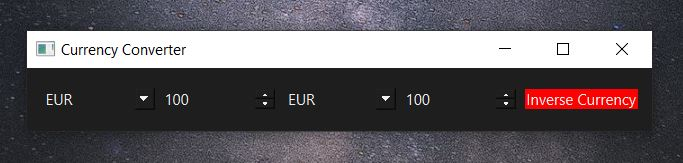
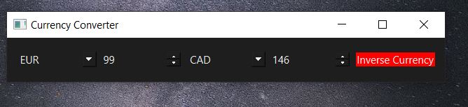

# An example of currency  conversion app

Note: Files in this  project are enough documented.
Every file almost represent a small project.
So you can pick one by one and try to understand the source code.

What you are going to learn in this finished small project:

How to CREATE a user interface structure.

How to CREATE a MAIN WINDOW with UI in PyQt( and especially PySide6).

How to CREATE  widgets.

How to CONVERT  currencies and DISPLAY result.

How to DEFINE DEFAULT VALUES of widgets.

How to connect widgets with methods.

How to Manage specific Errors using:try,except and else.

How to add CSS to change color of your app.

## Documentation

[Documentation](https://pypi.org/project/CurrencyConverter/)

## 🚀 About Author
Bonevy BEBY is a Software Engineer,an Accross Plateforms Archictecturer and a Trainer. He's also passionnate with DevOPs and Cloud Services.

## 🛠 Skills
Javascript, HTML, CSS,java,Javascript,Typescript,Python,PHP,DOT.NET...

@Accross plateforms trainer
My contacts: 00221 77 862 72 72 | bonevybeby@gmail.com