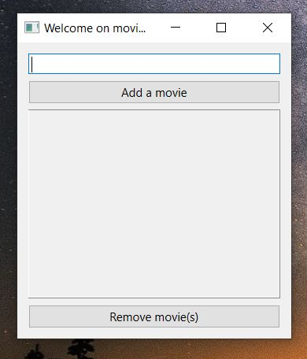
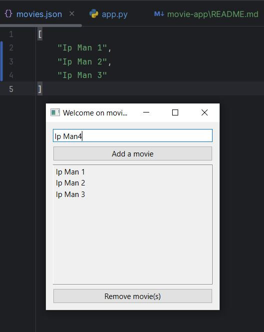
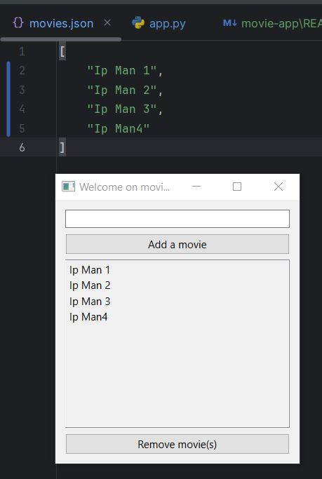
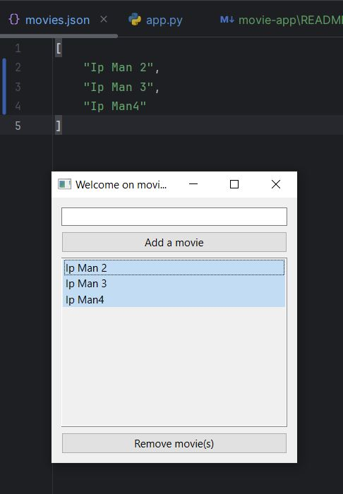
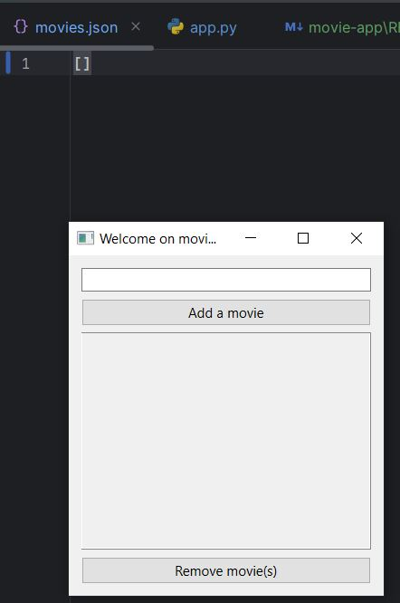

# This app is about an API to store DATA in json file and manipulate with GUI(PyQt)

Note: Manipulate a WIDGETS through this  movie app.

What you are going to learn through this unfinished project:

🚀 How to create and API

🚀 How to MANIPULATE lists and make CRUD operations

🚀 How to create a user interface structure.

🚀 How to SEPARATE UI and base class

🚀 How to CREATE a MAIN WINDOW with UI in PyQt( and especially PySide6).

🚀 How to CREATE  widgets.

🚀 How to connect class and GUI.

🚀 How to DEFINE DEFAULT VALUES of widgets.

🚀 How to connect widgets with methods.

🚀 How to make MULTIPLE SELECTIONS and MULTIPLE REMOVE(deletion).

## Documentation

[Documentation](https://pypi.org/project/CurrencyConverter/)

## 🚀 About Author
Bonevy BEBY is a Software Engineer,an Accross Plateforms Archictecturer and a Trainer. He's also passionnate with DevOPs and Cloud Services.

## 🛠 Skills
Javascript, HTML, CSS,java,Javascript,Typescript,Python,PHP,DOT.NET...

@Accross plateforms trainer
My contacts: 00221 77 862 72 72 | bonevybeby@gmail.com